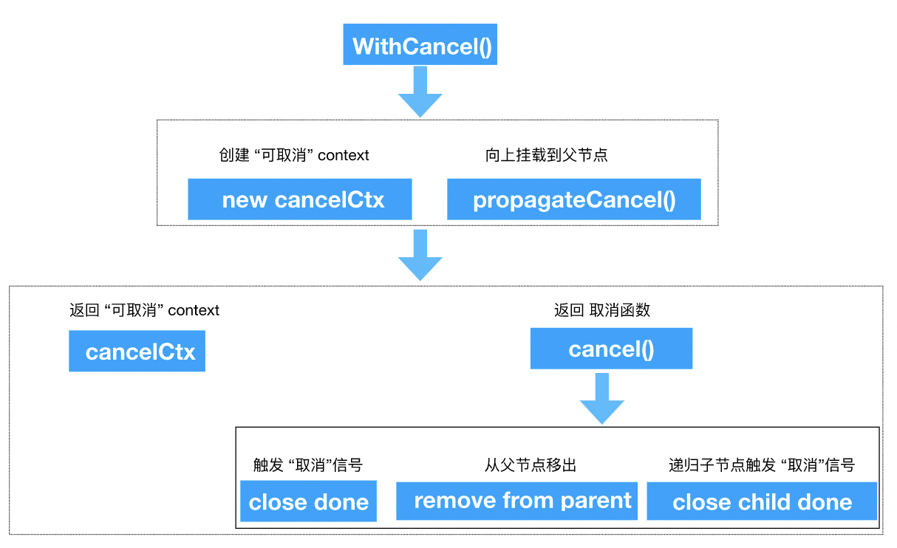

深入 Go 并发模型:Context

## 介绍
在Go服务器中，每个传入请求都在其自己的goroutine中处理。
请求处理程序通常会启动其他goroutine来访问后端，例如数据库和RPC服务。
处理请求的goroutine集合通常需要访问特定于请求的值，例如最终用户的身份，授权令牌和请求的截止日期。
当请求被取消或超时时，处理该请求的所有goroutine都应该快速退出，以便系统可以回收他们正在使用的任何资源。

Context是专门用来简化对于处理单个请求,多个goroutine之间数据共享、取消信号、超时处理等相关操作。翻译自 [Go Concurrency Patterns: Context](https://blog.golang.org/context)。

## 特性
* Context是gorountine并发安全的。
* 支持树状的上级控制一个或者多个下级，不支持反向控制和平级控制。
* gorountine传递cancel信号，结束子gorountine 生命。
* gorountine初始化启动子gorountine服务时，传入截止时刻或者超时时间来控制子gorountine。
* gorountine结束，对应的所有子gorountine生命周期结束。

## 使用场景
* 并发多服务调用情况下,比如一个请求进来，启动3个goroutine进行 RpcA 、RpcB 、RpcC三个服务的调用。这时候只要有其中一个服务错误，就返回错误，同时取消另外两个Rpc服务。可以通过 WithCancel 方法来实现。
* 超时请求，比如对Http、Rpc进行超时限制，可以通过 WithDeadline 和 WithTimeout 来实现。
* 携带数据，比如一个请求的用户信息，一般业务场景，我们会有一个专门的中间件来校验用户信息，然后把用户信息注入到context中，或者共享给派生出来的多个goroutine使用，可以通过 WithValue 方法实现。

## 官方示例
```
package main
import (
	"context"
	"fmt"
)

func main() {
	gen := func(ctx context.Context) <-chan int {
		dst := make(chan int)
		n := 1
		go func() {
			for {
				select {
				case <-ctx.Done():
					return // returning not to leak the goroutine
				case dst <- n:
					n++
				}
			}
		}()
		return dst
	}

	ctx, cancel := context.WithCancel(context.Background())
	defer cancel() // cancel when we are finished consuming integers

	for n := range gen(ctx) {
		fmt.Println(n)
		if n == 5 {
			break
		}
	}
}
```
## Context
context 是一个接口,定义如下：[源码](https://golang.org/src/context/context.go#L62)
```
type Context interface {
	Deadline() (deadline time.Time, ok bool)

	Done() <-chan struct{}

	Err() error

	Value(key interface{}) interface{}
}
```
包含了如下3个功能：
* 生存时间
* 取消信号
* request 派生的gorouting之间共享value

emptyCtx是对Context实现,分别实现了Deadline、Done、Err、Value、String方法,
```
type emptyCtx int

func (*emptyCtx) Deadline() (deadline time.Time, ok bool) {
	return 
}

func (*emptyCtx) Done() <-chan struct{} {
	return nil
}

func (*emptyCtx) Err() error {
	return nil
}

func (*emptyCtx) Value(key interface{}) interface{} {
	return nil
}

func (e *emptyCtx) String() string {
	switch e {
	case background:
		return "context.Background"
	case todo:
		return "context.TODO"
	}
	return "unknown empty Context"
}
```
## cancelCtx
从示例中，我们看到使用 context 第一个需要做的初始化操作
```
ctx, cancel := context.WithCancel(context.Background())
```
这里，context.Background() 返回的就是 emptyCtx 类型的指针。
```
var (
	background = new(emptyCtx)
	todo       = new(emptyCtx)
)

func Background() Context {
	return background
}

func TODO() Context {
	return todo
}
```
我们再来看看，WithCancel 函数接收了 background 作为参数，创建了一个cancelCtx实例。同时将Context 作为它的一个匿名字段，这样，它就可以被看成一个 Context。
```
func WithCancel(parent Context) (ctx Context, cancel CancelFunc) {
	c := newCancelCtx(parent)
	propagateCancel(parent, &c)
	return &c, func() { c.cancel(true, Canceled) } //什么意思，看下文您就明白了
}

func newCancelCtx(parent Context) cancelCtx {
	return cancelCtx{Context: parent}
}

type cancelCtx struct {
	Context

	mu       sync.Mutex            // protects following fields
	done     chan struct{}         // created lazily, closed by first cancel call
	children map[canceler]struct{} // set to nil by the first cancel call
	err      error                 // set to non-nil by the first cancel call
}
```
看下图，WithCancel 的主要职责是创建一个 cancelCtx,把自己挂载到父节点，然后返回cancelCtx和cancel()函数，用来触发取消事件。

cancelCtx 实现了自己的Done()、Err()、String()接口。值得关注的是，done 字段采用懒创建的方式， 在Done()第一次被调用的时候被创建,而且返回的是一个只读的Channel。
```
func (c *cancelCtx) Done() <-chan struct{} {
	c.mu.Lock()
	if c.done == nil {
		c.done = make(chan struct{})
	}
	d := c.done
	c.mu.Unlock()
	return d
}

func (c *cancelCtx) Err() error {
	c.mu.Lock()
	err := c.err
	c.mu.Unlock()
	return err
}

func (c *cancelCtx) String() string {
	return fmt.Sprintf("%v.WithCancel", c.Context)
}
```
不仅如此，cancelCtx最重要的是实现了 cancel() 方法。主工作流程如下：
1. 设置取消的错误提示信息
2. 关闭 channel:c.done
3. 递归 关闭所有子节点
4. 从父节点中删除自己
5. 最终通过关闭channel把取消信号，传递给所有子节点
```
func (c *cancelCtx) cancel(removeFromParent bool, err error) {
	if err == nil {
		panic("context: internal error: missing cancel error")
	}
	c.mu.Lock()
	// 已经被取消
	if c.err != nil {
		c.mu.Unlock()
		return 
	}
	// 设置 cancelCtx 错误信息
	c.err = err
	if c.done == nil {
		c.done = closedchan
	} else {
		close(c.done)
	}
	//  递归地取消所有子节点
	for child := range c.children {
		// NOTE: acquiring the child's lock while holding parent's lock.
		child.cancel(false, err)
	}
	// 清空子节点
	c.children = nil
	c.mu.Unlock()

	if removeFromParent {
		// 从父节点中移除自己 
		removeChild(c.Context, c)
	}
}
```
还有一个重点函数 **propagateCancel**需要重点关注
```
func propagateCancel(parent Context, child canceler) {
	// 父节点是一个空节点,可以理解为本节点为根节点，不需要挂载
	if parent.Done() == nil {
		return // parent is never canceled
	}
	// 父节点是可取消类型的
	if p, ok := parentCancelCtx(parent); ok {
		p.mu.Lock()
		if p.err != nil {
			// parent has already been canceled
			// 父节点被取消了，本节点也需要取消
			child.cancel(false, p.err)
		} else {
			if p.children == nil {
				p.children = make(map[canceler]struct{})
			}
			// 挂载到父节点
			p.children[child] = struct{}{}
		}
		p.mu.Unlock()
	} else {
		// 为了兼容，Context 内嵌到一个类型里的情况发生
		go func() {
			select {
			case <-parent.Done():
				child.cancel(false, parent.Err())
			case <-child.Done():
			}
		}()
	}
}
```
这里说明下上述代码中 else 的情况，为什么需要开一个goroutine来监控取消信号,先看下第一个case:
```
case <-parent.Done():
```
此处主要了为了避免cancelCtx被内嵌的一个类型中，做为匿名字段的情况，比如：
```
type CancelContext struct {
    Context
}
```
这时候 **parentCancelCtx 函数** 是无法正常识别出CancelContext是可取消类型的ctx。  
再看第二个 case：
```
case <-child.Done():
```
主要作用是在子节点取消的时候，可以让select语句正常退出，避免goroutine泄露。

通过如下parentCancelCtx源码，我们确定一旦入参的parent是经过包装的类型，parentCancelCtx就无法正确的识别出parent的类型。
```
func parentCancelCtx(parent Context) (*cancelCtx, bool) {
	for {
		switch c := parent.(type) {
		case *cancelCtx:
			return c, true
		case *timerCtx:
			return &c.cancelCtx, true
		case *valueCtx:
			parent = c.Context
		default:
			return nil, false
		}
	}
}
```
## timerCtx
从定义中我们可以看出timerCtx基于cancelCtx实现，多出了timer和deadline两个字段。而且timerCtx实现了自己的Deadline方法。
```
type timerCtx struct {
	cancelCtx
	timer *time.Timer // Under cancelCtx.mu.

	deadline time.Time
}

func (c *timerCtx) Deadline() (deadline time.Time, ok bool) {
	return c.deadline, true
}
```
因此我们直接看核心的函数WithDeadline
```
func WithDeadline(parent Context, d time.Time) (Context, CancelFunc) {
	// 判断父节点是否超时,(非timeCtx类型的Deadline()直接return的)
	// 如果父节点的超时时间比当前节点早，直接返回cancalCtx即可
	// 因为父节点超时会自动调用cancel，子节点随之取消，所以不需要单独处理子节点的超时问题
	if cur, ok := parent.Deadline(); ok && cur.Before(d) {
		// The current deadline is already sooner than the new one.
		return WithCancel(parent)
	}
	c := &timerCtx{
		cancelCtx: newCancelCtx(parent),
		deadline:  d,
	}
	propagateCancel(parent, c)
	dur := time.Until(d)
	// 直接取消
	if dur <= 0 {
		c.cancel(true, DeadlineExceeded) // deadline has already passed
		return c, func() { c.cancel(false, Canceled) }
	}
	c.mu.Lock()
	defer c.mu.Unlock()
	// 核心代码在这，如果当前节点没被取消，则通过time.AfterFunc在dur时间后调用cancel函数，自动取消。
	if c.err == nil {
		c.timer = time.AfterFunc(dur, func() {
			c.cancel(true, DeadlineExceeded)
		})
	}
	return c, func() { c.cancel(true, Canceled) }
}
// 基于WithDeadline封装实现
func WithTimeout(parent Context, timeout time.Duration) (Context, CancelFunc) {
	return WithDeadline(parent, time.Now().Add(timeout))
}
```

## valueCtx
源码比较简单，将Context 作为匿名字段来实现类型链表的接口，一层层传递，获取值主要查看Value方法，它会一层层判断是否有值，直到找到顶层的Context。
因此这里也有个要注意的地方，就是子节点的key值是会覆盖父节点的值，因此在命名key值得时候需要特别注意。
```
func WithValue(parent Context, key, val interface{}) Context {
	if key == nil {
		panic("nil key")
	}
	if !reflect.TypeOf(key).Comparable() {
		panic("key is not comparable")
	}
	return &valueCtx{parent, key, val}
}

// A valueCtx carries a key-value pair. It implements Value for that key and
// delegates all other calls to the embedded Context.
type valueCtx struct {
	Context
	key, val interface{}
}

func (c *valueCtx) String() string {
	return fmt.Sprintf("%v.WithValue(%#v, %#v)", c.Context, c.key, c.val)
}

func (c *valueCtx) Value(key interface{}) interface{} {
	if c.key == key {
		return c.val
	}
	return c.Context.Value(key)
}
```
## 解析
Done 方法返回 <-chan struct{} ,用来goroutine间进行消息通信。
## 参考
[Go Concurrency Patterns: Context](https://blog.golang.org/context)  
[Go context](http://kuanshijiao.com/2017/11/27/goc/)  
[深度解密Go语言之context](https://www.cnblogs.com/qcrao-2018/p/11007503.html)

## 结束
context的几个应用场景示例，欢迎关注我的[Github]([https://github.com/lvgithub/blog](https://github.com/lvgithub/blog)
)。