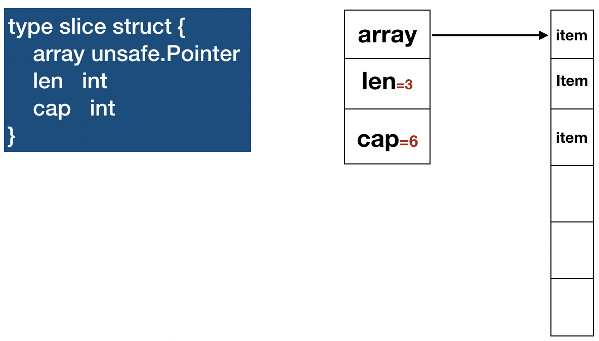

深入理解 Slice 

## 介绍

**slice** 是对数组的抽象,是对array的扩展,array的长度不可变，在特定场景中不太适用, **slice主要特点是不需要为它的容量担心，可以追加元素，在追加时可能使切片的容量增大。**。

我们直接深入Slice的底层实现原理，不再介绍Slice的基本使用（看文档就好拉）


## 结构[源码](https://golang.org/src/runtime/slice.go?h=type%20slice%20struct#L13) 

  

* slice中 array 是一个指针，它指向的是一个Array
* len 代表的是这个slice中的元素长度
* cap 是slice的容量

## 扩容[源码](https://golang.org/src/runtime/slice.go?h=growslice#L77)
```
s := []int{1,2,3,4,5,6}
s = append(s, 6)
```
* 如果新的slice大小是当前大小2倍以上，则大小增长为新大小
* 如果当前slice cap 小于1024，按每次2倍增长，否则每次按当前大小1/4增长。直到增长的大小超过或等于新大小
* append的实现是在内存中将slice的array值赋值到新申请的array

## 性能

* 通过上面我们知道slice的扩容涉及到**内存的拷贝**，这样带来的好处是数据存储在**连续内存上**，比随机访问快很多，最直接的性能提升就是**缓存命中率会高很多**,这也就是为什么slice不采用动态链表实现的原因吧
* 我们知道拷贝内存数据是有开销的， 而其中最大的开销不在 memmove 数据上，而是在开辟一块新内存malloc及之后的GC压力
* **拷贝连续内存是很快的**，随着cap变大，拷贝总成本还是 O(N) ,只是常数大了
* 假如不想发生拷贝，那你就没有连续内存。此时随机访问开销会是：链表 O(N)
* 能知道所需的最大空间时，在make的时候预留相应的 cap 就好
* 如果需要的空间很大，且每次都不确定，那就要在浪费内存和耗 CPU 在 malloc + gc 上做权衡
* 链表的查找操作是从第一个元素开始，所以相对数组要耗时间的多，因为采用这样的结构对读的性能有很大的提高


## 选择
* slice很灵活,大部分情况都能表现的很好
* slice的容量超大并且需要频繁的更改slice的内容时,改用list更合适

## 注意
如果你理解了上面内容，那下面这段代码的输出结果你就不意外了

```golang
s := []byte{1, 23, 4, 5, 67, 7}
s1 := s[2:3]
s1[0] = 100
fmt.Printf("s:%+v\n", s)
fmt.Printf("s[2] address is: %p\n", &s[2])
fmt.Printf("s1[1] address is: %p\n", &s1[0])
// s:[1 23 100 5 67 7]
// s[2]  address is: 0xc00007e004
// s1[1] address is: 0xc00007e004
```
 
没错，slice **s** 第三位的值4被替换为了100,这是因为slice **s1** 的底层array指针指向 slice **s** 的第三位，因此操作s1会影响切片s,因此赋值切片需要使用如下办法：
```
temp := copy(dst, src)
```
* **底层数组是可以被多个 slice 同时指向的**   
* 基于slice 创建新 slice 对象，新、老 slice 共用底层数组，对底层数组的更改都会影响到彼此。
* append可以掰断新老slice共用底层数组的关系(不理解？参考扩容部分，哈哈)

